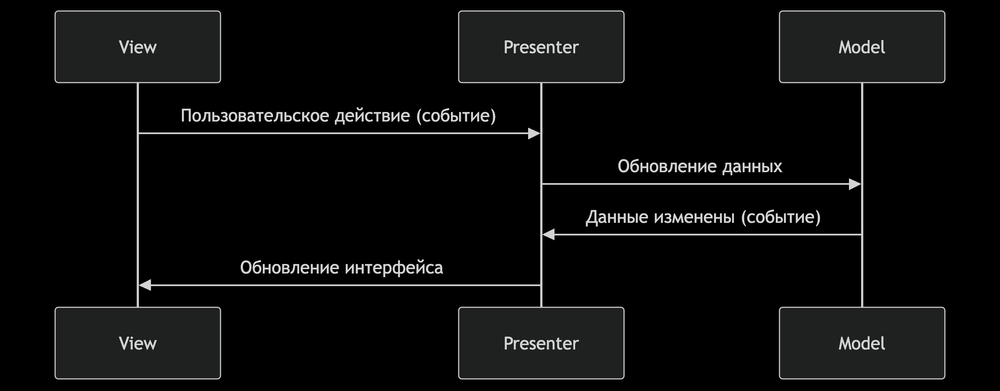

# 🛒 Проектная работа "Web-Ларёк"

## 📚 Оглавление

- [🛒 Проектная работа "Web-Ларёк"](#-проектная-работа-web-ларёк)
  - [📚 Оглавление](#-оглавление)
  - [📝 Описание проекта 🎯](#-описание-проекта-)
  - [🛠️ Стек технологий ⚙️](#️-стек-технологий-️)
  - [📁 Структура проекта](#-структура-проекта)
  - [📄 Важные файлы](#-важные-файлы)
  - [🚀 Установка и запуск ⚡](#-установка-и-запуск-)
  - [🏗️ Сборка проекта 🔧](#️-сборка-проекта-)
  - [🏛️ Архитектура приложения (MVP)](#️-архитектура-приложения-mvp)
  - [🔑 Основные сущности, интерфейсы и классы](#-основные-сущности-интерфейсы-и-классы)
    - [View (слой отображения)](#view-слой-отображения)
      - [**MainPage 🏠**](#mainpage-)
      - [**Card 🃏**](#card-)
      - [**Modal 🪟**](#modal-)
      - [**BasketView 🧺**](#basketview-)
      - [**ContactForm 📇**](#contactform-)
      - [**DeliveryForm 🚚**](#deliveryform-)
      - [**SuccessMessage 🎉**](#successmessage-)
    - [Model (слой данных)](#model-слой-данных)
      - [**AppState 🗄️**](#appstate-️)
      - [**BasketModel 🧺**](#basketmodel-)
    - [Presenter (слой посредника) ↔️](#presenter-слой-посредника-️)
    - [Вспомогательные классы](#вспомогательные-классы)
      - [**🌐 Api**](#-api)
      - [**EventEmitter**](#eventemitter)
  - [🔠 Типы данных](#-типы-данных)
  - [🔔 События 🔊](#-события-)
  - [🗺️ UML-схема](#️-uml-схема)

---

## 📝 Описание проекта 🎯

**Web-Ларёк** — учебный проект, реализующий витрину товаров с возможностью добавления в корзину и оформления заказа.
Проект построен на собственных компонентах, реализует паттерн "Наблюдатель" для событий и использует API для получения и отправки данных.

Архитектура приложения следует принципам MVP (Model-View-Presenter) с четким разделением ответственности между слоями:

- **Model** - работа с данными и бизнес-логикой
- **View** - отображение данных и взаимодействие с пользователем
- **Presenter** - координация между Model и View

---

## 🛠️ Стек технологий ⚙️

- ⚡ **HTML**, **SCSS**, **TypeScript**
- 🏗️ **Webpack** (сборка)
- 🎨 **PostCSS**, **Autoprefixer**
- 🧩 Собственные компоненты, **EventEmitter**, **API-клиент**
- ♻️ Архитектура MVP с событийным взаимодействием
- 💅 **Prettier** (форматирование кода)
- ✅ **ESLint** (проверка кода)
- 📦 **npm/yarn** (управление зависимостями)
- 🌐 API-клиент (работа с сервером)

---

## 📁 Структура проекта

```bash
src/
  components/        # 🧩 UI-компоненты (View)
  components/base/   # 📐 Абстрактные компоненты
  models/            # 🧠 Бизнес-логика и модели (Model)
  types/             # 📌 TS-интерфейсы
  utils/             # 🧰 Утилиты и константы
  pages/index.html   # 🏠 Шаблон главной страницы
  index.ts           # ⚡ Входная точка (Presenter)
  styles/styles.scss # 🎨 Глобальные стили
```

---

## 📄 Важные файлы

- `src/pages/index.html` — HTML-файл главной страницы и шаблоны
- `src/types/index.ts` — файл с типами данных и интерфейсами
- `src/index.ts` — точка входа приложения (Presenter)
- `src/styles/styles.scss` — корневой файл стилей
- `src/utils/constants.ts` — файл с константами
- `src/utils/utils.ts` — файл с утилитами

---

## 🚀 Установка и запуск ⚡

1. **Клонируйте репозиторий:**

    ```bash
    git clone https://github.com/your-username/web-larek-frontend.git
    cd web-larek-frontend
    ```

2. **Установите зависимости:**

    ```bash
    npm install
    ```

    или

    ```bash
    yarn
    ```

3. **Запустите проект в режиме разработки:**

    ```bash
    npm run start
    ```

    или

    ```bash
    yarn start
    ```

---

## 🏗️ Сборка проекта 🔧

Для сборки проекта используйте команду:

```bash
npm run build
```

или

```bash
yarn build
```

Собранные файлы будут находиться в папке `dist/`.

---

## 🏛️ Архитектура приложения (MVP)

Архитектура построена по паттерну **MVP (Model-View-Presenter)** с использованием событийной модели ("Наблюдатель") для слабого связывания между слоями.

- **Model (Модель):**  
  Отвечает за хранение и обработку данных (товары, корзина, заказ). Не зависит от представления.  
  Примеры: классы моделей AppState, BasketModel.

- **View (Представление):**  
  Отвечает за отображение данных и работу с DOM (главная страница, карточки товаров, корзина, формы, модальные окна, финальное сообщение).  
  Не содержит бизнес-логики, только визуализация и обработка пользовательских событий.

- **Presenter (Презентер):**  
  Связывает модель и представление, реагирует на пользовательские действия, обновляет модель и инициирует обновление представления.  
  Взаимодействие между слоями реализовано через события с помощью класса EventEmitter.  
  В проекте роль Presenter выполняет модуль `index.ts`, где создаются экземпляры всех классов и настраиваются подписки на события.

**Взаимодействие слоёв:**

- Пользователь взаимодействует с View.
- View генерирует событие.
- Presenter обрабатывает событие и обновляет Model.
- Model обновляет данные и генерирует событие об изменениях.
- Presenter получает событие и обновляет View


---

## 🔑 Основные сущности, интерфейсы и классы

### View (слой отображения)

#### **MainPage 🏠**

Отвечает за отображение галереи товаров на главной странице.
**📋 Поля:**

- galleryContainer: HTMLElement - контейнер для галереи товаров
- basketButton: HTMLButtonElement - кнопка корзины (класс .header__basket)
- basketCounter: HTMLElement - счётчик товаров (класс .header__basket-counter)

**🛠 Методы:**

- renderGallery(cards: HTMLElement[]): void - отображает массив карточек товаров
- setBasketCount(count: number): void - обновляет счётчик товаров
- setBasketClickHandler(handler: () => void): void - устанавливает обработчик клика на корзину
  
**💡 Особенности:**

- Не зависит от структуры карточки товара
- Работает с готовыми DOM-элементами карточек

#### **Card 🃏**

Универсальный класс для создания карточек товара

**🏗️ Конструктор:**

- constructor(template: HTMLTemplateElement, handleClick?: (event: MouseEvent) => void)

**🛠 Методы:**

- renderGallery(data: IProduct): HTMLElement - создаёт карточку для галереи
- renderPreview(data: IProduct): HTMLElement - создаёт карточку для предпросмотра
- renderBasket(item: IBasketItem): HTMLElement - создаёт карточку для корзины

**Особенности:**

- Поддерживает разные шаблоны для разных контекстов
- Принимает обработчик клика для интерактивных элементов

#### **Modal 🪟**

Универсальный контейнер для модальных окон

**📋 Поля:**

- container: HTMLElement - контейнер модального окна (id="modal-container")

**🛠 Методы:**

- open(content: HTMLElement): void - открывает модальное окно с переданным контентом
- close(): void - закрывает модальное окно и очищает контент
- setContent(content: HTMLElement): void - устанавливает контент модального окна

#### **BasketView 🧺**

Отображает содержимое корзины

**📋 Поля:**

- container: HTMLElement - контейнер корзины
- itemsContainer: HTMLElement - контейнер для списка товаров
- totalElement: HTMLElement - элемент для отображения суммы
- orderButton: HTMLButtonElement - кнопка оформления заказа

**🛠 Методы:**

- render(items: HTMLElement[], total: number): void - отображает товары и сумму
- setOrderHandler(handler: () => void): void - устанавливает обработчик оформления заказа

#### **ContactForm 📇**

Форма для ввода контактных данных

**📋 Поля:**

- form: HTMLFormElement - элемент формы
- emailInput: HTMLInputElement - поле email
- phoneInput: HTMLInputElement - поле телефона
- submitButton: HTMLButtonElement - кнопка отправки

**🛠 Методы:**

- getData(): IContactData - возвращает введенные данные
- setSubmitHandler(handler: () => void): void - устанавливает обработчик отправки
- showErrors(errors: TFormErrors): void - отображает ошибки валидации
- reset(): void - сбрасывает значения формы

#### **DeliveryForm 🚚**

Форма для ввода адреса и выбора способа оплаты

**📋 Поля:**

- form: HTMLFormElement - элемент формы

- addressInput: HTMLInputElement - поле адреса
- cardPaymentRadio: HTMLInputElement - переключатель оплаты картой
- cashPaymentRadio: HTMLInputElement - переключатель оплаты наличными
- submitButton: HTMLButtonElement - кнопка отправки

**🛠 Методы:**

- getData(): { address: string, payment: TPaymentType } - возвращает введенные данные
- setSubmitHandler(handler: () => void): void - устанавливает обработчик отправки
- showErrors(errors: TFormErrors): void - отображает ошибки валидации
- reset(): void - сбрасывает значения формы

#### **SuccessMessage 🎉**

Отображает сообщение об успешном оформлении заказа

**📋 Поля:**

- container: HTMLElement - контейнер сообщения (id="success")
- closeButton: HTMLButtonElement - кнопка закрытия
- totalElement: HTMLElement - элемент для отображения суммы заказа

**🛠 Методы:**

- show(total: number): void - отображает сообщение с суммой заказа
- setCloseHandler(handler: () => void): void - устанавливает обработчик закрытия

---

### Model (слой данных)

#### **AppState 🗄️**

Главная модель состояния приложения.

**📋 Поля:**

- catalog: IProduct[] - массив всех товаров
- basket: IBasketItem[] - товары в корзине
- preview: IProduct | null - товар для предпросмотра
- order: IOrderData | null - данные заказа

**🛠 Методы:**

- loadCatalog(): Promise<void> - загружает каталог товаров с сервера
- addToBasket(product: IProduct): void - добавляет товар в корзину
- removeFromBasket(id: string): void - удаляет товар из корзины
- clearBasket(): void - очищает корзину
- getBasketCount(): number - возвращает количество товаров в корзине
- getBasketTotal(): number - возвращает общую сумму корзины
- setPreview(product: IProduct): void - устанавливает товар для предпросмотра
- setOrderField(field: keyof IOrderData, value: any): void - устанавливает поле заказа
- validateOrder(): boolean - проверяет валидность данных заказа
- submitOrder(): Promise<boolean> - отправляет заказ на сервер

#### **BasketModel 🧺**

- Модель корзины (может быть частью AppState).
- Поля: массив товаров в корзине.
- Методы: `add(item)`, `remove(id)`, `clear()`, `getTotal()`, `getItems()`.

---

### Presenter (слой посредника) ↔️

Реализован в файле src/index.ts:

- Создает экземпляры всех классов View и Model
- Настраивает подписки на события через EventEmitter
- Координирует взаимодействие между View и Model
- Обрабатывает ошибки и управляет состоянием приложения

**Основные обработчики:**

- Инициализация приложения
- Обработка событий карточек товаров
- Управление корзиной
- Обработка форм заказа
- Управление модальными окнами

---

### Вспомогательные классы

#### **🌐 Api**

- Класс для работы с сервером.

**🛠 Методы:**

- get(endpoint: string): Promise<T> - GET-запрос
- post(endpoint: string, data: object): Promise<T> - POST-запрос
- handleResponse(response: Response): Promise<T> - обработка ответа

#### **EventEmitter**

Классический брокер событий (паттерн "Наблюдатель").

**🛠 Методы:**

- on(event: string, handler: Function): void - подписка на событие
- off(event: string, handler: Function): void - отписка от события
- emit(event: string, ...args: any[]): void - генерация события

---

## 🔠 Типы данных

Типы данных определены в [`src/types/index.ts`](src/types/index.ts):

- **IProduct** — товар (id, title, description, image, price, category)
- **IBasketItem** — товар в корзине (дополнительно index)
- **IBasketState** — состояние корзины (items, total)
- **TPaymentType** — тип оплаты ('card' | 'cash')
- **IOrderData** — данные заказа (total, items, email, phone, address, payment)
- **IContactData** — контактные данные (email, phone)
- **IApiListResponse<T>** — универсальный ответ API
- **IApiError** — ошибка API
- **TAppEvent** — события приложения (например, 'modal:open', 'basket:update')
- **TFormErrors** — ошибки формы

---

## 🔔 События 🔊

Взаимодействие между компонентами осуществляется через систему событий:

| Событие           | Генерирует | Данные                 | Описание |
|-------------------|------------|------------------------|----------|
| `catalog:loaded`  | Model      | `IProduct[]`           | Каталог товаров загружен |
| `preview:changed` | Model      | `IProduct \| null`     | Изменен товар для предпросмотра |
| `basket:changed`  | Model      | `IBasketItem[]`        | Изменено содержимое корзины |
| `card:select`     | View       | `IProduct`             | Пользователь выбрал карточку товара |
| `basket:add`      | View       | `IProduct`             | Пользователь добавил товар в корзину |
| `basket:remove`   | View       | `string` (ID товара)   | Пользователь удалил товар из корзины |
| `order:submit`    | View       | `IOrderData`           | Пользователь отправил заказ |
| `order:success`   | Model      | `number` (сумма заказа)| Заказ успешно оформлен |
| `form:error`      | View       | `TFormErrors`          | Ошибки валидации формы |

**Пример обработки событий:**

```ts
// Подписка на изменение корзины
events.on('basket:changed', (items: IBasketItem[]) => {
  // Обновляем счетчик в шапке
  mainPage.setBasketCount(items.length);
  
  // Обновляем корзину
  const basketCards = items.map(item => 
    card.renderBasket(item)
  );
  basketView.render(basketCards, appState.getBasketTotal());
});

// Обработка выбора карточки
events.on('card:select', (product: IProduct) => {
  // Устанавливаем товар для предпросмотра
  appState.setPreview(product);
  
  // Создаем карточку для модального окна
  const previewCard = card.renderPreview(product);
  
  // Открываем модальное окно
  modal.open(previewCard);
});
```

**Взаимодействие:**  

- MainPage использует Card для создания элементов галереи
- BasketView использует Card для создания элементов корзины
- Modal отображает содержимое различных компонентов
- Presenter координирует взаимодействие между всеми компонентами
- AppState централизует управление состоянием приложения
  
**Принципы взаимодействия:**

- Компоненты View не обращаются друг к другу напрямую
- Все изменения состояния проходят через Model
- Presenter выступает посредником в коммуникации
- События - единственный способ взаимодействия между слоями

---

## 🗺️ UML-схема


