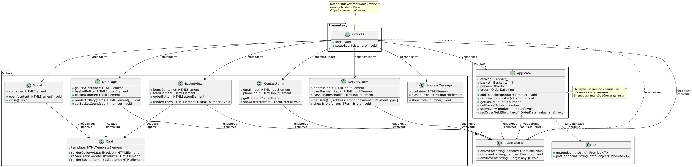

# 🛒 Проектная работа "Web-Ларёк"

## 📚 Оглавление

- [🛒 Проектная работа "Web-Ларёк"](#-проектная-работа-web-ларёк)
  - [📚 Оглавление](#-оглавление)
  - [📝 Описание проекта](#-описание-проекта)
  - [🛠️ Стек технологий](#️-стек-технологий)
  - [📁 Структура проекта](#-структура-проекта)
  - [📄 Важные файлы](#-важные-файлы)
  - [🚀 Установка и запуск](#-установка-и-запуск)
  - [🏗️ Сборка проекта](#️-сборка-проекта)
  - [🏛️ Архитектура приложения](#️-архитектура-приложения)
  - [🔑 Основные сущности, интерфейсы и классы](#-основные-сущности-интерфейсы-и-классы)
    - [Интерфейсы (см. `src/types/index.ts`)](#интерфейсы-см-srctypesindexts)
    - [Классы](#классы)
      - [🌐 Api](#-api)
      - [📢 EventEmitter](#-eventemitter)
      - [🧩 Component](#-component)
      - [💬 PopupComponent](#-popupcomponent)
      - [🛍️ Basket](#️-basket)
      - [🃏 Card](#-card)
      - [📬 Contact](#-contact)
  - [🔠 Типы данных](#-типы-данных)
  - [🔔 События](#-события)
  - [🗺️ UML-схема](#️-uml-схема)

---

## 📝 Описание проекта

**Web-Ларёк** — учебный проект, реализующий витрину товаров с возможностью добавления в корзину и оформления заказа.  
Проект построен на собственных компонентах, реализует паттерн "Наблюдатель" для событий и использует API для получения и отправки данных.

---

## 🛠️ Стек технологий

- ⚡ **HTML**, **SCSS**, **TypeScript**
- 🏗️ **Webpack** (сборка)
- 🎨 **PostCSS**, **Autoprefixer**
- 🧩 Собственные компоненты, **EventEmitter**, **API-клиент**

---

## 📁 Структура проекта

```bash
src/
  components/        # UI-компоненты
  components/base/   # абстрактные компоненты
  models/            # бизнес-логика и модели
  types/             # TS-интерфейсы
  utils/             # утилиты и константы
  pages/index.html   # шаблон страницы
  index.ts           # входная точка приложения
  styles/styles.scss # стили
```

---

## 📄 Важные файлы

- `src/pages/index.html` — HTML-файл главной страницы
- `src/types/index.ts` — файл с типами данных и интерфейсами
- `src/index.ts` — точка входа приложения
- `src/styles/styles.scss` — корневой файл стилей
- `src/utils/constants.ts` — файл с константами
- `src/utils/utils.ts` — файл с утилитами

---

## 🚀 Установка и запуск

1. **Клонируйте репозиторий:**

    ```bash
    git clone https://github.com/your-username/web-larek-frontend.git
    cd web-larek-frontend
    ```

2. **Установите зависимости:**

    ```bash
    npm install
    ```

    или

    ```
    yarn
    ```

3. **Запустите проект в режиме разработки:**

    ```bash
    npm run start
    ```

    или

    ```
    yarn start
    ```

---

## 🏗️ Сборка проекта

Для сборки проекта используйте команду:

```bash
npm run build
```

или

```bash
yarn build
```

Собранные файлы будут находиться в папке `dist/`.

---

## 🏛️ Архитектура приложения

Архитектура построена по паттерну **MVP (Model-View-Presenter)** с использованием событийной модели (паттерн "Наблюдатель") для слабого связывания между слоями.

- **Model (Модель):**  
  Отвечает за хранение и обработку данных (товары, корзина, заказ). Не зависит от представления.  
  Примеры: классы моделей корзины, товаров.

- **View (Представление):**  
  Отвечает за отображение данных и работу с DOM (карточки товаров, корзина, формы, модальные окна).  
  Не содержит бизнес-логики, только визуализация и обработка пользовательских событий.

- **Presenter (Презентер):**  
  Связывает модель и представление, реагирует на пользовательские действия, обновляет модель и инициирует обновление представления.  
  Взаимодействие между слоями реализовано через события с помощью класса EventEmitter.

**Взаимодействие слоёв:**

- Модель изменяет данные и уведомляет презентер через события.
- Презентер обновляет представление, подписываясь на события модели.
- Представление отправляет пользовательские действия презентеру, который обновляет модель.
- API-клиент изолирован от представления, работает только с моделью.

**Преимущества выбранной архитектуры:**

- Слабое связывание между слоями.
- Лёгкая масштабируемость и тестируемость.
- Чёткое разделение ответственности.

---

## 🔑 Основные сущности, интерфейсы и классы

### Интерфейсы (см. [`src/types/index.ts`](src/types/index.ts))

- **IProduct** — товар, приходящий из API.
- **IBasketItem** — товар в корзине (расширяет IProduct, добавляет индекс).
- **IBasketState** — состояние корзины (массив товаров и сумма).
- **TPaymentType** — тип оплаты ('card' | 'cash').
- **IOrderData** — данные заказа для отправки на сервер.
- **IContactData** — контактные данные для формы.
- **IApiListResponse<T>** — универсальный ответ API со списком.
- **IApiError** — ошибка API.
- **IApiClient** — интерфейс API-клиента (методы get, post).
- **IBasketModel** — интерфейс модели корзины (методы для управления корзиной).
- **IProductView** — интерфейс отображения товара (метод render).
- **IBasketView** — интерфейс отображения корзины (метод render).
- **IComponent** — интерфейс базового компонента (методы render, setVisible, setDisabled).
- **TAppEvent** — перечисление событий приложения.
- **IEventEmitter** — интерфейс брокера событий (on, off, emit).
- **TFormErrors** — ошибки формы.

### Классы

#### 🌐 Api

Класс для работы с сервером.  
**Функции:**  

- Выполнение GET и POST-запросов.
- Обработка ответов и ошибок.
- Использует интерфейс `IApiClient`.

#### 📢 EventEmitter

Классический брокер событий (паттерн "Наблюдатель").  
**Функции:**  

- Подписка и отписка на события (`on`, `off`).
- Вызов слушателей при возникновении события (`emit`).
- Подписка на все события (`onAll`).
- Сброс всех обработчиков (`offAll`).
- Использует интерфейс `IEventEmitter`.

#### 🧩 Component

Абстрактный базовый класс для UI-компонентов.  
**Функции:**  

- Управление DOM-элементами.
- Методы для изменения состояния элементов (`setText`, `setImage`, `setDisabled`, `setVisible`, `setHidden`, `toggleClass`).
- Метод `render` для отрисовки компонента (реализуется в наследниках).
- Использует интерфейс `IComponent`.

#### 💬 PopupComponent

Модальное окно, наследует Component.  
**Функции:**  

- Методы: `open`, `close`, `render`, сеттер `content`.
- Взаимодействует с EventEmitter для событий открытия/закрытия.

#### 🛍️ Basket

Компонент корзины, наследует Component.  
**Функции:**  

- Методы: обновление списка товаров, суммы, активности кнопки.
- Использует интерфейс `IBasketView`.

#### 🃏 Card

Карточка товара, наследует Component.  
**Функции:**  

- Методы: установка данных, изменение состояния кнопки.
- Использует интерфейс `IProductView`.

#### 📬 Contact

Форма контактов, наследует Component.  
**Функции:**  

- Методы: установка и валидация email/телефона.

---

## 🔠 Типы данных

Типы данных определены в [`src/types/index.ts`](src/types/index.ts):

- **IProduct** — товар (id, title, description, image, price, category)
- **IBasketItem** — товар в корзине (дополнительно index)
- **IBasketState** — состояние корзины (items, total)
- **TPaymentType** — тип оплаты ('card' | 'cash')
- **IOrderData** — данные заказа (total, items, email, phone, address, payment)
- **IContactData** — контактные данные (email, phone)
- **IApiListResponse<T>** — универсальный ответ API
- **IApiError** — ошибка API
- **TAppEvent** — события приложения (например, 'modal:open', 'basket:update')
- **TFormErrors** — ошибки формы

---

## 🔔 События

В проекте используются события для связи между слоями данных и представления. Основные события:

- `modal:open`, `modal:close` — открытие/закрытие модального окна
- `basket:update` — обновление корзины
- `order:submit`, `order:success`, `order:error` — оформление заказа
- `product:add`, `product:remove` — работа с товарами
- `form:validate`, `form:error` — валидация форм

---

## 🗺️ UML-схема

